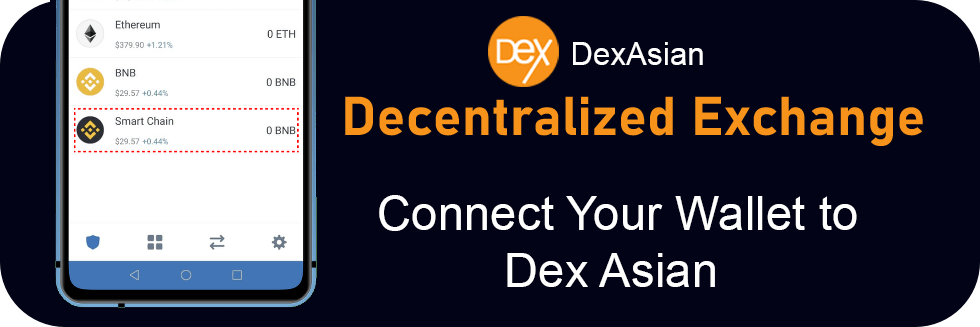
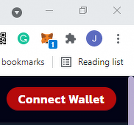

# Connect Your Wallet to  Dex Asian

You've made a wallet and gotten your BEP20 tokens, now you just need to connect your wallet with Dex Asian and you're good to go!

Check out the steps below for how to connect each of our recommended wallets to Dex Asian.

## Smartphone/Mobile



.png>)

To connect Trust Wallet follow the steps below. Note that Android and iOS devices do not use the same steps!

### Android

1. Open Trust Wallet and tap the **DApps** button on the bottom of the screen.
2. Scroll down to "Popular" and tap on "Alpine Dex". You can also find it in "Exchanges".
3. A new page will open with the PancakeSwap logo and some information. Tap the **Connect** button.
4. PancakeSwap will open up. If you see a **Connect** button in the top-right tap that and tap **Trust Wallet** from the list.


If you find you are unable to connect at step 4, go back to the DApps menu and find "PancakeSwap" again. Using "Pancake Swap" from the "History" section may result in the same problem.


### iOS

To connect to PancakeSwap through iOS, Trust Wallet have prepared a detailed guide on using WallteConnect.

Read the [Trust Wallet guide to connecting to Alpine Dex via WalletConnect](https://community.trustwallet.com/t/using-walletconnect-to-access-pancakeswap/212307).

### **Resources**

[**Download Trust Wallet**](https://trustwallet.com) (Automatically detects device)\
[**Trust Wallet Setup Guide**](https://www.binance.com/en/blog/421499824684901157/how-to-set-up-and-use-trust-wallet-for-binance-smart-chain)



.png>)

To connect MetaMask to PancakeSwap follow the steps below.

### Android and iOS

1. Open MetaMask and tap on the **burger icon** in the top-left.

.png>)

2\. Tap **Settings** in the menu.

.png>)

3\. In the Settings menu, tap on **Network**.

.png>)

4\. Tap on the **Add Network** button at the bottom.

.png>)

5\. On the page that opens, type in the following details:

**Network Name:** Binance Smart Chain\
**RPC Url:** [https://bsc-dataseed.binance.org](https://bsc-dataseed.binance.org)\
**Chain ID:** 56\
**Symbol:** BNB\
**Block Explorer URL:** [http://bscscan.com](http://bscscan.com)

1. Once you've confirmed entry of the new network, go back to the burger menu and tap **Browser**.

.png>)

1. Type "PancakeSwap" into the search field and start the search. The top result will be the PancakeSwap exchange. Tap to enter it.
2. You wallet will ask you to connect. Tap **Connect** to connect to PancakeSwap.

.png>)

### Resources

[**Download MetaMask**](https://metamask.io/download.html) (Automatically detects device)\
[**MetaMask Setup Guide**](https://academy.binance.com/en/articles/connecting-metamask-to-binance-smart-chain\))

\




## **Desktop/Web Browser wallets**



.png>)



### Chrome and Firefox

1. Open MetaMask and click on the **network selector** at the top. By default it will show "Ethereum Mainnet". Scroll down and click **Custom RPC**.

 (1).png>)

1. A window will open. Type in the details below.

**Network Name:** Binance Smart Chain\
**New RPC URL:** [https://bsc-dataseed.binance.org](https://bsc-dataseed.binance.org)\
**Chain ID:** 56\
**Currency Symbol (optional):** BNB\
**Block Explorer URL (optional):** [http://bscscan.com](http://bscscan.com)

.png>)

1. Make sure you've typed everything in correctly and click **Save**. Binance Smart Chain will now be one of your network options.

 (1).png>)

1. Visit the Alpine Dex website. In the top right corner, you'll see the **Connect Wallet** button. Click it.

1. A window will appear asking you to choose a wallet to connect to. Click **MetaMask** (it's the top option on the list).

### Resources

[**Download MetaMask**](https://metamask.io/download.html) (Automatically detects browser)\
[**MetaMask Setup Guide**](https://academy.binance.com/en/articles/connecting-metamask-to-binance-smart-chain)




### Chrome and Firefox

1. Open Binance Chain Wallet and click on the network selector at the top. The default network will be Binance Chain. Choose **Binance Smart Chain** from the list.

1. Visit the PancakeSwap website. In the top-right, click **Connect**.

1. A window will appear asking you to choose a wallet to connect to. Click **Binance Chain Wallet** (it's farther down the list).

### Resources

[**Download Binance Wallet**](https://www.binance.org/en) (Automatically detects browser)\
**Binance Wallet Setup Guide**




### Desktop Application

1. When you open the application, DApps should be the default page (if not, click to the DApps page).
2. Half way down the page you'll see a list of networks to choose from. Click **BSC**.

1. On the list of BSC DApps, you'll find PancakeSwap links. Click a **PancakeSwap** link.


Make sure you don't choose the "PancakeSwap data analysis" option. If you do, you will not be able to connect.


1. Your browser will open a PancakeSwap tab and attempt to connect to Token Pocket.


You will not be able to use both MetaMask and TokenPocket connecting through the same web browser. Make sure you use a web browser without MetaMask plugin installed if you're using TokenPocket on your desktop computer.


### Resources

[**Download Token Pocket Desktop Wallet**](https://www.tokenpocket.pro/en/download/pc) (MacOS or Win64)\
**Token Pocket Desktop Setup Guide**




**Remember - NEVER, under any situation, should you ever give someone your private key or recovery phrases.**







