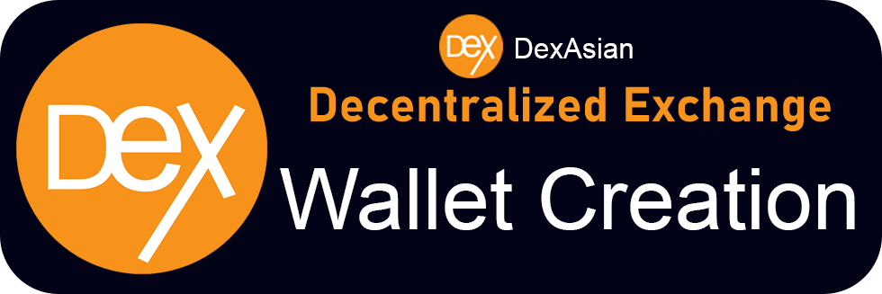

# Create Wallet

To get started on Dex Asian, the first thing you'll need is to set up a wallet that supports Binance Smart Chain (BSC). Wallets are available both on desktop computers and on smartphone devices. You'll need to choose the wallet that fits your needs best.

**When you're setting up a wallet, be sure to:**

* ✅ **Download and install only the latest version from an official source.**
* ✅ **Follow the setup guide carefully.**
* ✅ **Safely back up your recovery phrases.**
* ❌ **NEVER share your recovery phrases with anyone, under any circumstances.**
* ❌ **NEVER input your recovery phrase to a website or app, other than your wallet app.**

## Smartphone/Mobile or Desktop wallet?

Mobile device wallets and desktop-based wallets have different strengths and weaknesses. Consider which fits your needs better to help decide which type of wallet to use.

| Description                       | Mobile | Desktop |
| --------------------------------- | ------ | ------- |
| Use anywhere                      | ✅      | ➖       |
| Easy to use                       | ✅      | ➖       |
| More Secure                       | ➖      | ✅       |
| Accessibility friendly            | ➖      | ✅       |
| Damage/loss/theft resistant       | ➖      | ✅       |
| Power/connection outage resistant | ✅      | ➖       |

## **Smartphone/Mobile wallets**

Smartphone/Mobile wallets allow you to access your crypto almost anywhere. Wallets are available on both Android and iOS devices.

### Which mobile wallet should I choose?

This comparison table gives an overview of the most popular mobile wallets used with **Dex Asian**.

| Description                                              | Trust Wallet                  | SafePal | Metamask | Token Pocket |
| -------------------------------------------------------- | ----------------------------- | ------- | -------- | ------------ |
| Binance Smart Chain support                              | ✅                             | ✅       | ⚠️       |              |
| Built-in DApp browser                                    | 
✅ Android

⚠️ iOS
 | ✅       | ➖        |              |
| Hardware wallet compatible                               | ➖                             | 🔶      | ✅        |              |
| Open source (auditability)                               | ✅                             | ➖       | ✅        |              |
| 
Interact with BscScan

(for advanced users!)
 | ➖                             | ➖       | ✅        |              |
|                                                          |                               |         |          |              |

⚠️ Requires some setup

🔶 Only supports SafePal hardware wallet

You can find more in-depth information about each wallet below, as well as download links and installation guides.



.png>)

Trust Wallet is a popular wallet for smart devices. It supports DApps, NFT collectibles (with Opensea.io support), and in-wallet staking.

**Pros:**

* Open source for auditability
* Backed by the Binance cryptocurrency exchange
* Easily switch between several crypto networks
* Includes networks by default
* Includes in-wallet staking options
* Has additional features such as NFT collection, BNB staking, and DApp access within the wallet

**Cons:**

* Language tied to phone settings
* Limited DApps
* Transaction notifications can be delayed

[**Download Trust Wallet**](https://trustwallet.com) (Automatically detects device)\
[**Trust Wallet Setup Guide**](https://www.binance.com/en/blog/421499824684901157/How-to-Set-Up-and-Use-Trust-Wallet-for-Binance-Smart-Chain)



.png>)

MetaMask is a very popular browser-based wallet plugin that supports ERC20 (Ethereum network) and BEP2 & BEP20 (Binance Chain and Binance Smart Chain networks).

**Pros:**

* Open source for auditability
* WEB3 capable on BscScan
* A strong history of security and reliability
* A large amount of how-to guides and resources online
* Many tools and custom settings
* Offers ETH purchases with Transak
* Supports a very large number of languages
* Is also available a browser plugin for desktop devices

**Cons:**

* Longer setup time than other options
* Additional steps needed to use with Binance Smart Chain and PancakeSwap
* Extra information and settings may confuse beginners

[**Download MetaMask**](https://metamask.io/download.html) (Automatically detects device)\
[**MetaMask Setup Guide**](https://academy.binance.com/en/articles/connecting-metamask-to-binance-smart-chain)



.png>)

SafePal is available as both a software and hardware wallet. The wallet is easy to install and create, and comes ready to support BEP2 (Binance Chain) and BEP20 (Binance Smart Chain) right away.

**Pros:**

* Easily switch between several crypto networks
* Offers 25% fee discount paying with BNB (requires login)
* Has the option for Google Authenticator built in
* Supports a large number of languages
* Setup process is very simple
* Is available as both a software and hardware wallet (work together)
* Supports NFTs on both the BSC and ETH networks

**Cons:**

* Isn't fully open source
* Has some features that are not yet ready for use (such as DeFi)
* Does not give user notifications
* Does not enforce strong security during initial setup and wallet creation
* Has fewer online resources than more established wallets

​[**Download SafePal**](https://safepal.io/download) (Automatically detects device)\
[**SafePal Setup Guide**](https://blog.safepal.io/binance-smart-chain-x-safepal/)



## **Desktop/Web Browser wallets**

Desktop wallets are available on your home computer or laptop computer. Wallets on your computer can run as standalone applications, or as web browser plugins for popular browsers like Chrome and Firefox.

### Which desktop wallet should I choose?

This comparison table gives an overview of the most popular desktop wallets used with **Dex Asian**

| Description                                              | MetaMask | Binance Wallet |
| -------------------------------------------------------- | -------- | -------------- |
| Binance Smart Chain support                              | ⚠️       | ✅              |
| Built-in DApp browser                                    | ➖        | ➖              |
| Hardware wallet compatible                               | ✅        | ✅              |
| Open source (auditability)                               | ✅        | ✅              |
| 
Interact with BscScan

(for advanced users!)
 | ✅        | ➖              |

⚠️ Requires additional setup

You can find more in-depth information about each wallet below, as well as download links and installation guides.



.png>)



.png>)

Binance Wallet is a browser-plugin wallet that natively supports the Binance Chain (BEP2) Binance Smart Chain (BEP20) networks. Binance Wallet was developed by the Binance cryptocurrency exchange.

**Pros:**

* Open source for auditability
* Backed by the Binance cryptocurrency exchange
* Can be directly linked to a Binance or Gmail account
* A streamlined user experience
* Supports Binance Smart Chain by default, making using Alpine Dex easy
* Supports a large number of languages
* Hardware wallet compatible

**Cons:**

* Lacks some custom settings of other wallets
* Lack of additional tools makes some actions available in other wallets impossible
* Has fewer online resources than more established wallets

[**Download Binance Wallet**](https://www.binance.org/en) (Automatically detects browser)\
[**Binance Wallet Setup Guide**](https://docs.binance.org/smart-chain/wallet/binance.html)



MetaMask is a very popular browser-based wallet plugin that supports ERC20 (Ethereum network) by default, and BEP2 & BEP20 (Binance Chain and Binance Smart Chain networks) with a little work.

​**Pros:**

* Open source for auditability
* WEB3 capable on BscScan
* A strong history of security and reliability
* A large amount of how-to guides and resources online
* Many tools and custom settings
* Supports a very large number of languages
* Is also available on mobile devices

**Cons:**

* Longer setup time than other options
* Additional steps needed to use with Binance Smart Chain and Alpine Dex
* Extra information and settings may confuse beginners

[**Download MetaMask**](https://metamask.io/download.html) (Automatically detects browser)\
[**MetaMask Setup Guide**](https://academy.binance.com/en/articles/connecting-metamask-to-binance-smart-chain)

\*\*NEVER, in any situation, should you ever give someone your private key or recovery phrase ("seed phrase"). This will give someone complete access to your crypto!

The genuine Alpine Dex site and staff will never ask you to input your seed phrase.\*\*
